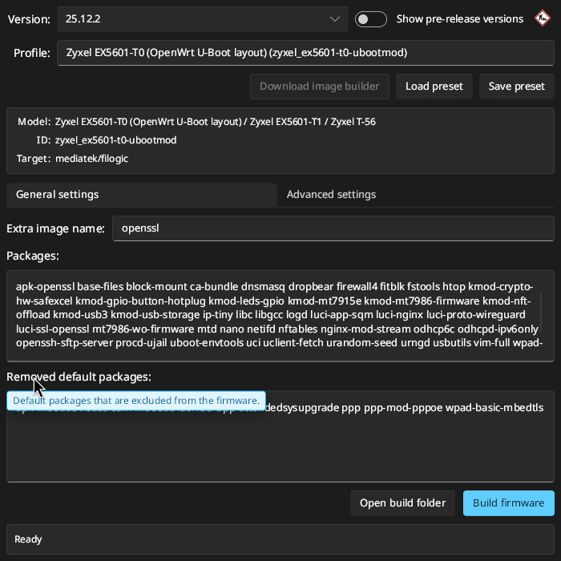

<p align="center">


<h1 align="center">Bouwer</h1>

</p>

Bouwer is a simple desktop interface for building customized OpenWrt firmware
images using the official image builders and package repositories.

Bouwer means builder in Dutch.

## Features

- Allows easy configuration of installed packages, setting the size of the root
  filesystem, disabling unwanted services, and including a filesystem overlay
  with your custom files.
- Uses official OpenWrt image builder images (via Podman or Docker).
- Stores and loads your build configurations as presets, making it easy to reuse
  settings for newer OpenWrt versions.
- Caches OpenWrt profile metadata, packages, and image builders to speed up
  subsequent operations.
- Supports OpenWrt version 21.02 and above, including release candidates.

## Requirements

A working internet connection.

A working installation of [Podman](https://podman.io/docs/installation) or
[Docker](https://www.docker.com/products/docker-desktop/). Bouwer uses these
container engines to run OpenWrt image builder containers. On Linux use your
package manager, on Windows - the official websites to install either of them.
Additionally, on Linux, Docker must be accessible _without_ super user
privileges, by e.g. adding your user to the `docker` group.

1 to 3 gigabytes of free disk space for each target and free disk space for the
firmware images.

Currently, modern Linux and Windows running on x86/64 are supported. macOS on
aarch64 is doable, but there's no practical way for me to test this at the
moment, although the basic macOS-specific hooks are there.

## Installation

Download prebuilt binaries from the [release page](https://github.com/GeorgeSapkin/bouwer/releases).

## Usage

> [!IMPORTANT]
>
> Bouwer _must not_ be run with super user or administrator privileges.

> [!NOTE]
>
> Ensure Podman or Docker is running _before_ starting Bouwer.

The UI is self-explanatory with some elements having tooltips on hover.



After you select a version and a profile, if the relevant image builder has
not been cached yet, you can download it by clicking the _Download image
builder_ button.

Once an image builder is downloaded, you can customize the firmware and press
_Build firmware_. When done, click _Open build folder_ to locate your
freshly-built firmware images.

You can save your customization using _Save preset_ to be reused for later
builds.

> [!IMPORTANT]
>
> When setting the build folder, use a new one, that's not shared with any other
> applications, to avoid permission errors when mounting volumes in a container.

### Building from Source

You will need a [Rust toolchain](https://www.rust-lang.org/tools/install)
installed along with OS-specific
[Slint dependencies](https://github.com/slint-ui/slint/blob/master/docs/building.md).


1. **Clone the repository:**

   ```bash
   git clone https://github.com/georgesapkin/bouwer.git
   cd bouwer
   ```

2. **Build the application:**

   ```bash
   cargo build --release
   ```

The executable will be located in `target/release/`.

## Issues

- After loading a preset, the profile text box loses the visual focus indicator,
  even though it's focused.

## License

Copyright (C) 2026 George Sapkin

GNU General Public License v3.0 only
